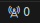

# Introduction 
+ Realtime chat app with Laravel, ReactJS, Laravel Echo, SocketIO, Redis
+ Documents: [Link](https://viblo.asia/p/viet-ung-dung-chat-realtime-voi-laravel-vuejs-redis-va-socketio-laravel-echo-Qpmle9Q9lrd)
## Overview
This app contains following features:
+ Multiple chat rooms
+ Realtime chat with Presence Channel
## Installation 
### Prerequisite
Check if you have `redis` installed, by running command: `redis-cli`
### Install guide
+ Clone this project
+ Run the following command:
``` 
composer intall
npm install
cp .env.example .env
php artisan key:generate
npm install -g laravel-echo-serve
```
+ Set up `.env`
```
BROADCAST_DRIVER=redis
CACHE_DRIVER=redis
FILESYSTEM_DISK=local
QUEUE_CONNECTION=redis
SESSION_DRIVER=redis
SESSION_LIFETIME=120

REDIS_HOST=127.0.0.1
REDIS_PASSWORD=your_redis_password
REDIS_PORT=6379
```
+ Set up `laravel-echo-server.json`
```json
"redis": {
    "port":"6379",
    "host":"127.0.0.1",
    "database": "0",
    "password":"your_redis_password"
},
```
## Run the app
```
php artisan serve
npm run watch
laravel-echo-server start
php artisan queue:work
```
## Use ngrok
1. Open vscode, click , and add `6001` in port column
2. Copy address open file resource/js/bootstrap.js
```js
window.Echo = new Echo({
    broadcaster: 'socket.io',
    host: "6001_port_address",
});
```
3. open new terminal window
```
ngrok http 8000
```
